# Commande

- Search:
  

- Pull:
  

- Image:
  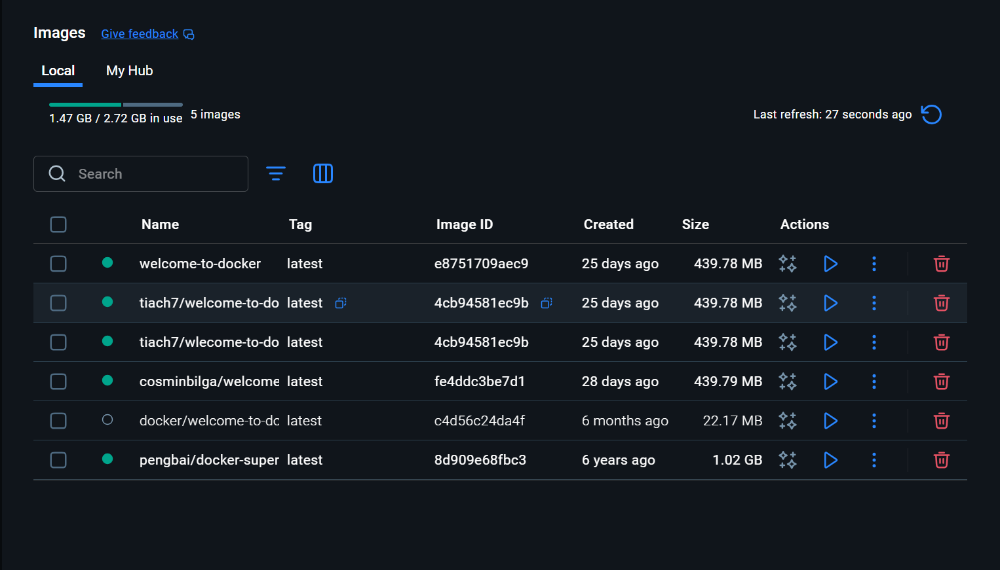

- Run:
  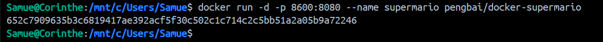
  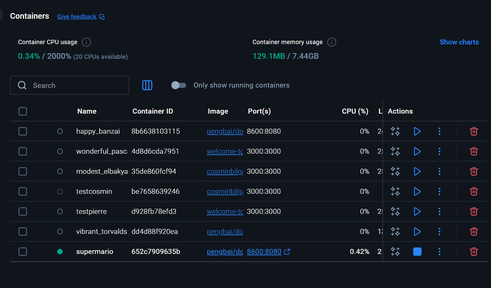
  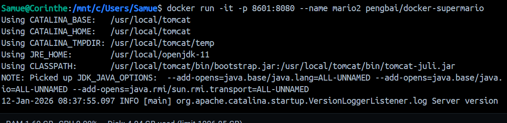

- Usage:
  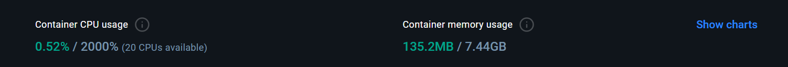
  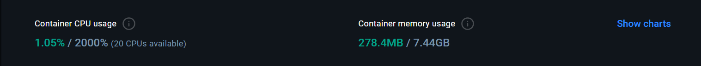

- Gameplay:
  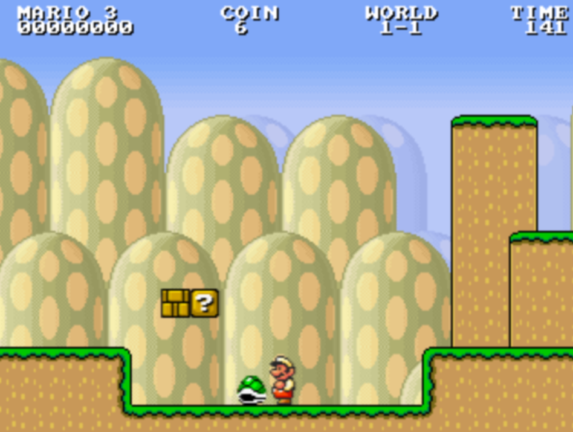
  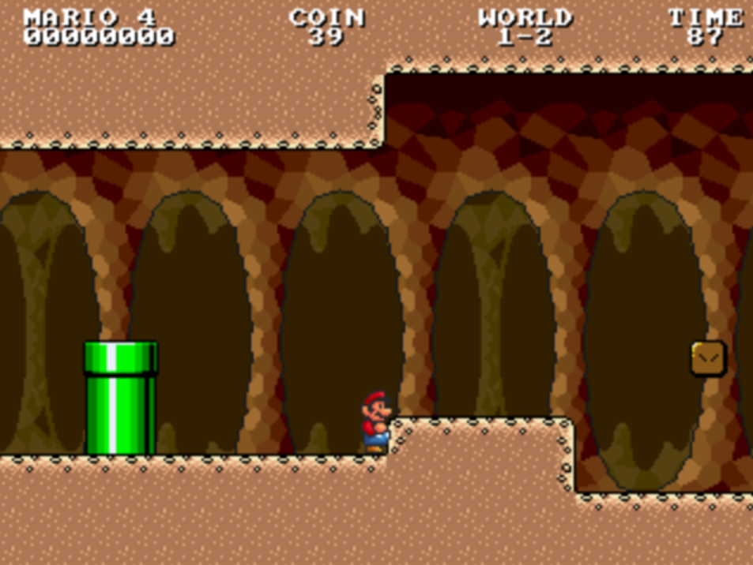
  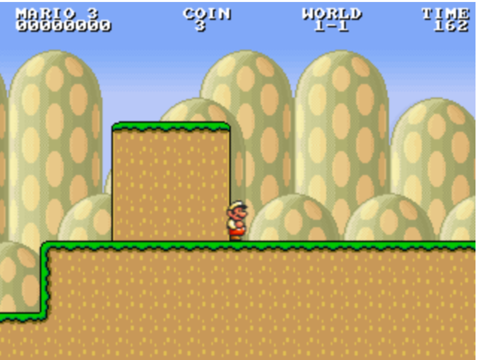
  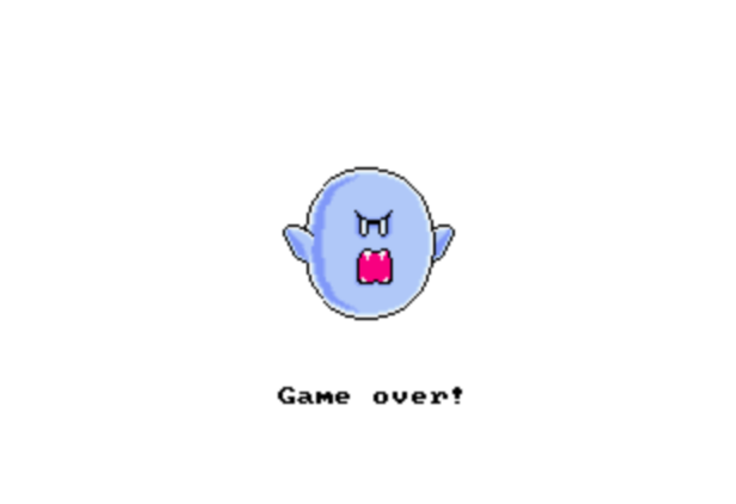

- 2 Façons de trouver l'id:
  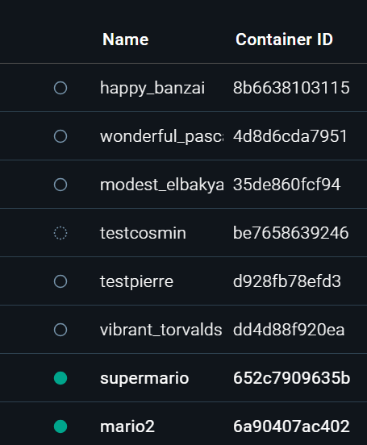
  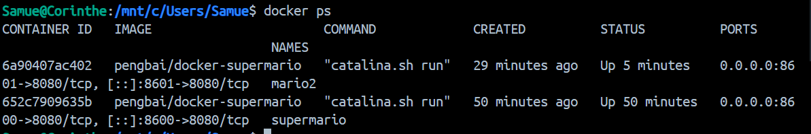

- Stop:
  
  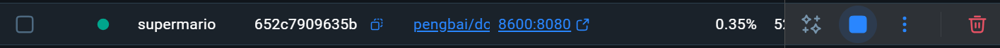

- Usage stop
  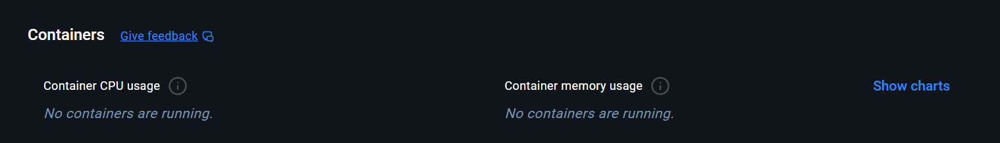

- Rm conteneurs:
  
  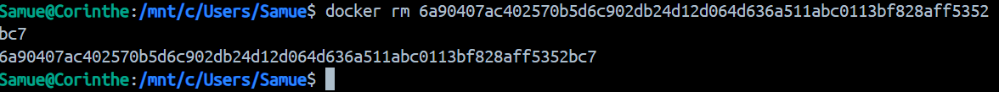

- Rmi  l'image:
  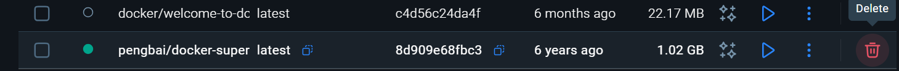
  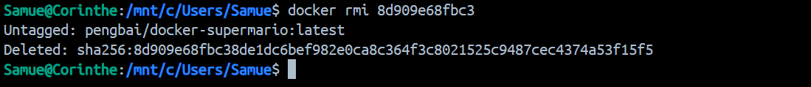
